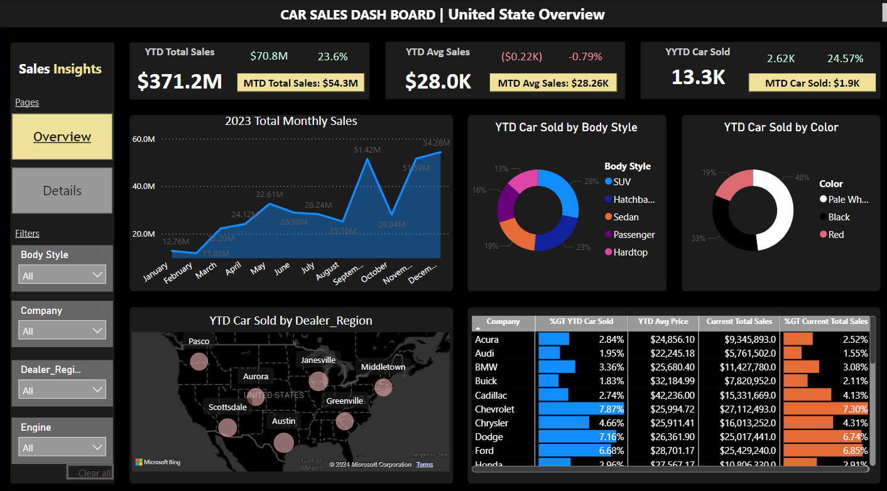
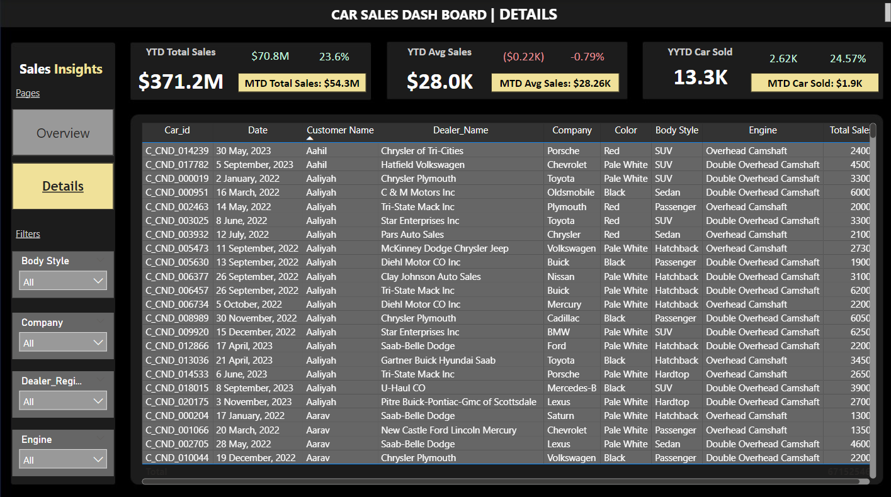

# Car Sales Dashboard

## A Detailed Analysis of Global Car Sales Trends

### Background
Our company is a car dealership that sells various car models. To effectively track and analyze our sales performance, we need a comprehensive **Car Sales Dashboard** in Power BI. 

### Objective
The objective of this project is to design and develop a dynamic and interactive **Car Sales Dashboard** using Power BI. The dashboard will visualize critical KPIs related to our car sales, helping us understand our sales performance over time and make data-driven decisions.

## Dashboard Preview

### **Page 1: Sales Overview and KPIs**

### **Page 2: Detailed Sales Information**

---

## Problem Statement 1: KPI Requirements

The dashboard should provide real-time insights into key performance indicators (KPIs) related to our sales data. This will enable us to make informed decisions, monitor our progress, and identify trends and opportunities for growth.

### **Sales Overview:**
- **Year-to-Date (YTD) Total Sales**
- **Month-to-Date (MTD) Total Sales**
- **Year-over-Year (YOY) Growth in Total Sales**
- **Difference between YTD Sales and Previous Year-to-Date (PTYD) Sales**

### **Average Price Analysis:**
- **YTD Average Price**
- **MTD Average Price**
- **YOY Growth in Average Price**
- **Difference between YTD Average Price and PTYD Average Price**

### **Cars Sold Metrics:**
- **YTD Cars Sold**
- **MTD Cars Sold**
- **YOY Growth in Cars Sold**
- **Difference between YTD Cars Sold and PTYD Cars Sold**

---

## Problem Statement 2: Charts Requirement

### **1. YTD Sales Weekly Trend:**
A line chart illustrating the weekly trend of YTD sales. The X-axis should represent weeks, and the Y-axis should show the total sales amount.

### **2. YTD Total Sales by Body Style:**
Visualize the distribution of YTD total sales across different car body styles using a pie chart.

### **3. YTD Total Sales by Color:**
Present the contribution of various car colors to the YTD total sales through a pie chart.

### **4. YTD Cars Sold by Dealer Region:**
Showcase the YTD sales data based on different dealer regions using a map chart to visualize the sales distribution geographically.

### **5. Company-Wise Sales Trend in Grid Form:**
A tabular grid displaying the sales trend for each company, showcasing the company name along with their YTD sales figures.

### **6. Details Grid Showing All Car Sales Information:**
Create a detailed grid that presents all relevant information for each car sale, including car model, body style, color, sales amount, dealer region, date, etc.

---

## Getting Started

To view the interactive Power BI dashboard:
1. Download the `.pbix` file from this repository.
2. Open the file in [Power BI Desktop](https://powerbi.microsoft.com/desktop/).
3. Explore the visualizations and insights presented in the dashboard.

---

